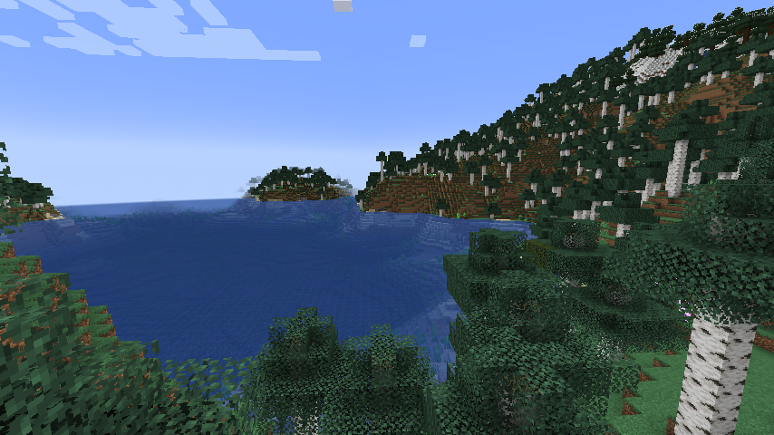

# The Last One

TLO是一个Minecraft整合包，立志于让玩家拥有更困难的游戏体验。 TLO受到了僵尸启示录、惊变100天等整合包的启发，融入了多项怪物增强mod，加强“末日”、“单人勇闯MC”的体验。游戏对部分老电脑，笔记本压力较大，推荐使用台式机或者游戏本。内置显核可以支撑本整合包（AMD Redaon Vega 8 Graphics可以稳定在30fps左右）。

当前Minecraft版本为1.19.2，需要JDK17。 整合包采用Forge API，可以添加mod，并没有高清修复等其他Mod支持光影，光影和材质包请自行安装。

##游戏主题
僵尸：低吼； 苦力怕：嘶嘶嘶~ 身处疫区的你以及无法逃脱。早期玩家因为感染一种未知病毒而变为僵尸，苦力怕等等敌对生物。当心！！僵尸的走搭和垫高速度远高于你！！高空绝对不是安全的地方。庇护所不再安全，因为苦力怕会炸毁一切玩家的东西，来辅助僵尸进攻。注意身后！！！几乎所有怪物都能够乘坐鹦鹉飞翔！ 战斗吧，玩家！这里有丰厚的奖励。超级难打的稀有精英怪那里有意想不到的宝物；亡灵军团的礼物等待领取；血月之夜的怪物军团必定有极为雄厚的战利品。 注意身体，不要过热或者过冷，多喝点水。
